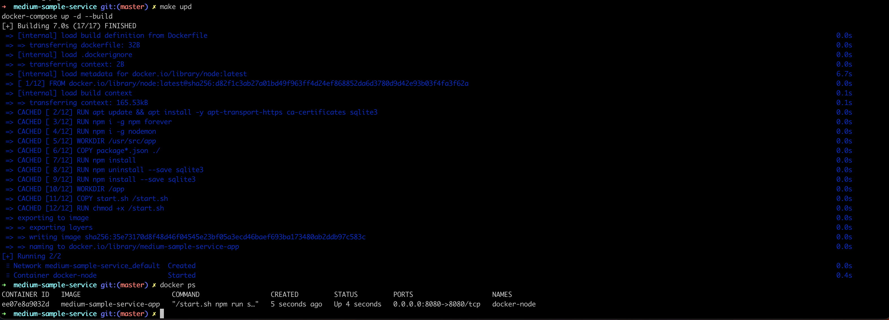
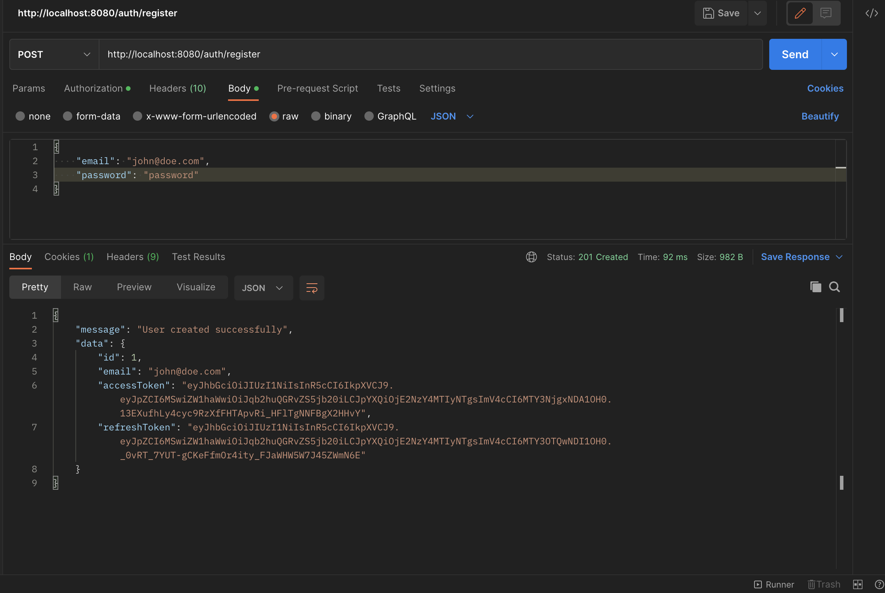
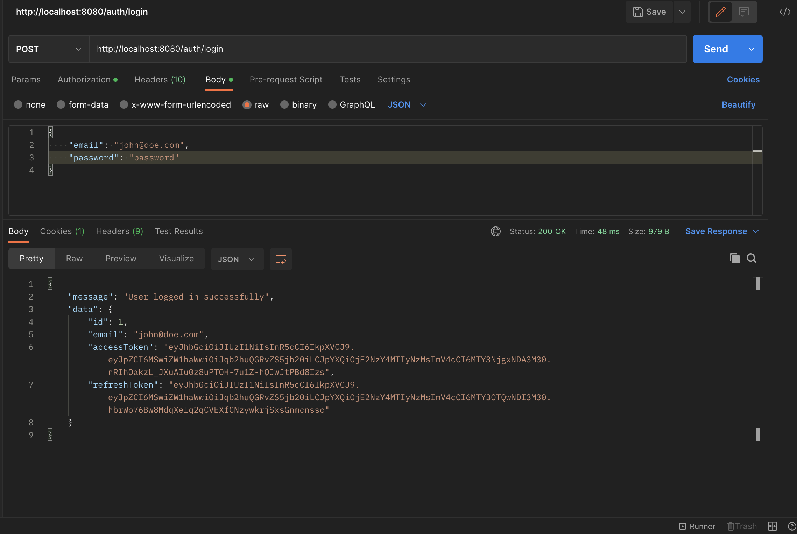
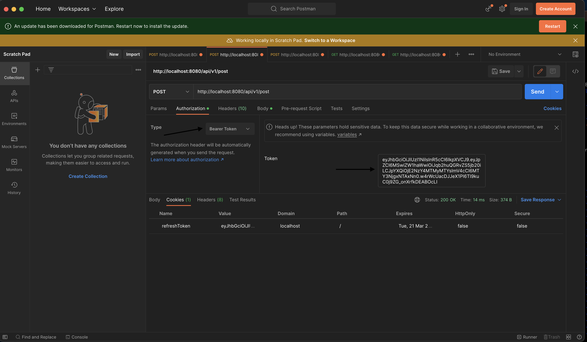
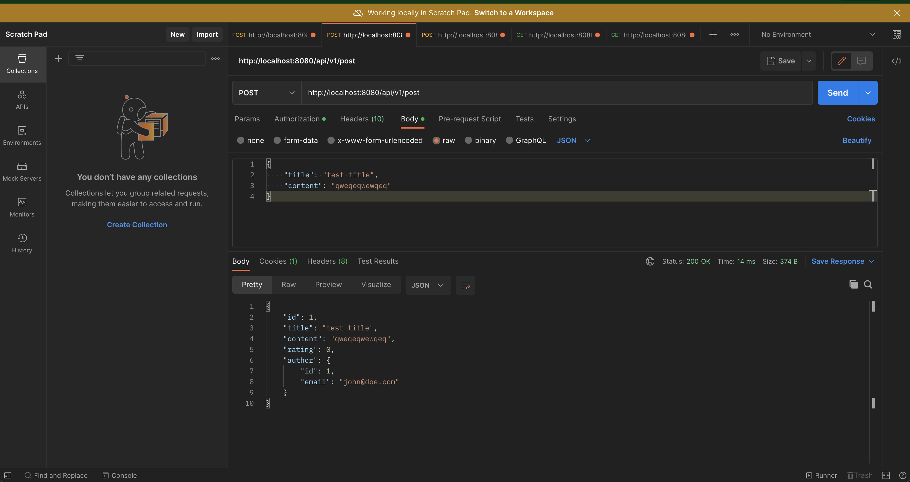
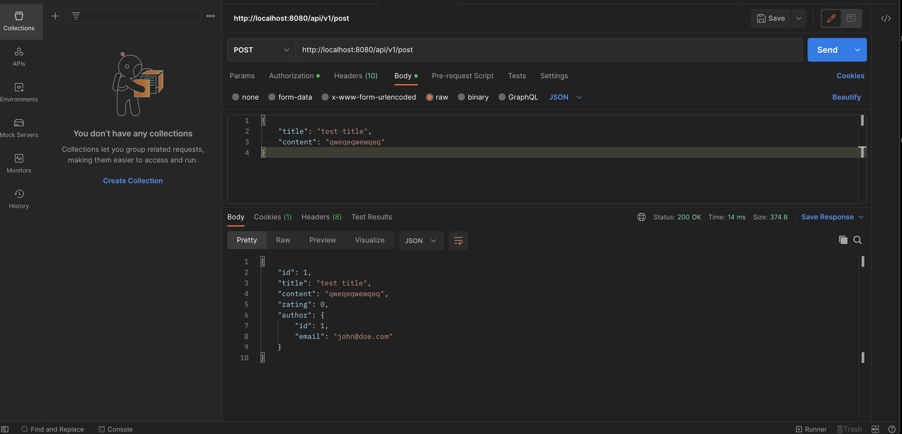
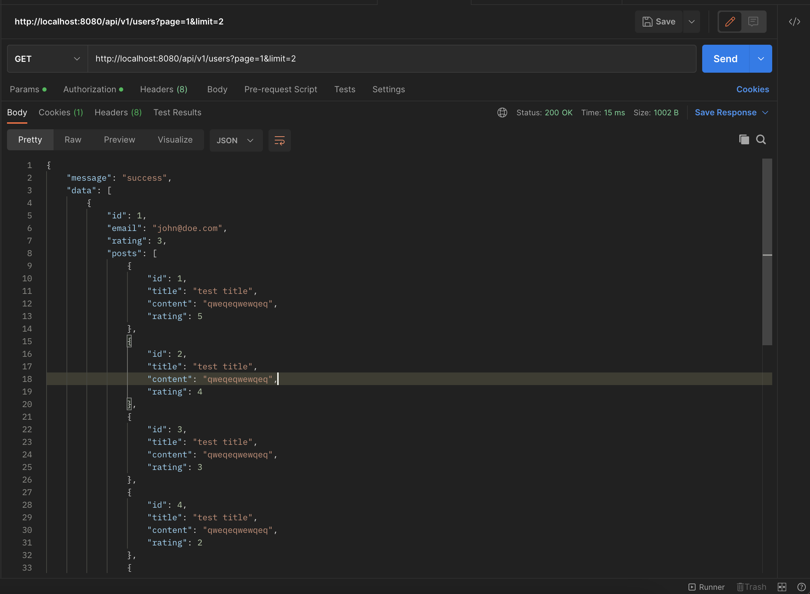
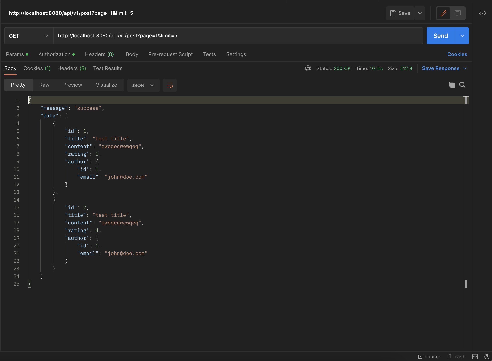

# Medium-sample-service with Docker, Node and Sqlite

## What was used

- Docker
- Docker-Compose
- npm
- Node.js
- Express
- Nodemon
- Sequelize
- SQLite3

## To start run app Run
```
docker-compose up -d --build 
```
OR

```
make upd
```



## Authorization EndPoints

```
POST  /auth/register
POST  /auth//login
POST  /auth/refresh
GET   /auth/logout
```





## Post EndPoints

```
GET      /api/v1/post
GET      /api/v1/post/:id
POST     /api/v1/post
POST     /api/v1/post/rating
PUT      /api/v1/post
DELETE   /api/v1/post/:id
```

## How to get access

> This process needs `Bearer Token` selected and need to add access_token.  



## And then we can add/get/delete/update posts



## To set rating to the post send request with data:
```json
{
  "id": "1",
  "rating": 5
}
```



## User EndPoints

```
GET      /api/v1/users
GET      /api/v1/users/:id
```

## Posts and Users with pagination
se


